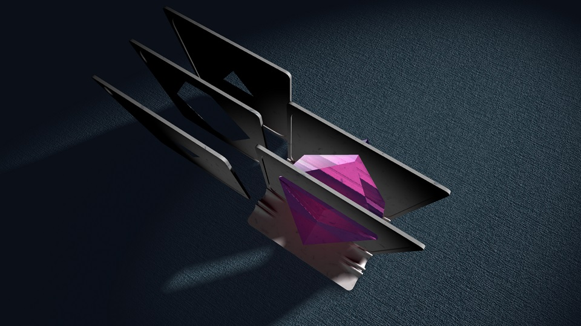

# Viu
Virtual design for models for vision impairement users.

# About

These models are build for the National Scientific Program
"Information and Communication Technologies in Science,
Education and Security" (ICTinSES) financed by the Ministry
of Education and Science.

Click on a snapshot to run it live in the browser.

# Pythagorean theorem

This is a virtual prototype of a 3D printed model that demonstrates
a visual proof of Pythagorean theorem. Its general layout is similar
to the 15 puzzle game. Instead of 15 squares there are 4 right
triangles that can slide inside a frame. The triangles can be moved
in a way to recreate the proof of the theorem.

The right trangle shape is configurable. Here are three versions of the same model:

Apart from demonstrating a visual and tactile proof of the Pythagorean theorem,
the application can be used to demonstrate or explore:

- Area of parallelograms;
- Garden of Eden puzzles;
- Similar right triangles;    
- Second degree equations.

# Slide rule

This is a virtual prototype of a 3D printed model of a slide rule.
It is modified version of an ordinary logarithmic slide rule, with
added relief marks and thread cursor. All three combonents &ndash;
the two rulers and the cursor can slide sideways.

The slide rule is configurable &ndash; it can be extended or shrinked,
which makes it possible to generate a slide rule for operations like
multiplication, division, square root, etc.

The application can be used to demonstrate or explore:

- Operations like <em>xy</em>, <em>x/y</em> and <em>1/x</em>;
- Operations like <em>x^n</em> and <em>x^(1/n)</em>;
- Overflow and underflow calculations;
- Mathematical foundations of the slide rule.

# Cross sections

This is a virtual prototype of a model and collection of
plates to demonstrate and explore cross sections of various
solids. The solid is represented as a glassy object, although
in reality it will be 3D printed too and it will be inserted
into the plates, instead of just sliding the plates.

There are many objects that can be examined. Here are three examples:

Here are links to all models:

- [Cube №1](https://boytchev.github.io/viu/model-cross/index.html?a=2), [Cube №2](https://boytchev.github.io/viu/model-cross/index.html?a=3), [Cube №3](https://boytchev.github.io/viu/model-cross/index.html?a=4) and [Cube №4](https://boytchev.github.io/viu/model-cross/index.html?a=5)
- [Brick №1](https://boytchev.github.io/viu/model-cross/index.html?a=6) and [Brick №2](https://boytchev.github.io/viu/model-cross/index.html?a=7)
- [Pyramid №1](https://boytchev.github.io/viu/model-cross/index.html?a=18), [Pyramid №2](https://boytchev.github.io/viu/model-cross/index.html?a=19) and [Pyramid №3](https://boytchev.github.io/viu/model-cross/index.html?a=20)
- [Sphere](https://boytchev.github.io/viu/model-cross/index.html?a=1)
- [Cylinder №1](https://boytchev.github.io/viu/model-cross/index.html?a=11), [Cylinder №2](https://boytchev.github.io/viu/model-cross/index.html?a=12) and [Cylinder №3](https://boytchev.github.io/viu/model-cross/index.html?a=13)
- [Cone №1](https://boytchev.github.io/viu/model-cross/index.html?a=14), [Cone №2](https://boytchev.github.io/viu/model-cross/index.html?a=15), [Cone №3](https://boytchev.github.io/viu/model-cross/index.html?a=16) and [Cone №4](https://boytchev.github.io/viu/model-cross/index.html?a=17)
- [Torus №1](https://boytchev.github.io/viu/model-cross/index.html?a=8), [Torus №2](https://boytchev.github.io/viu/model-cross/index.html?a=9) and [Torus №3](https://boytchev.github.io/viu/model-cross/index.html?a=10)
- [Capsule №1](https://boytchev.github.io/viu/model-cross/index.html?a=21), [Capsule №2](https://boytchev.github.io/viu/model-cross/index.html?a=22) and [Capsule №3](https://boytchev.github.io/viu/model-cross/index.html?a=23)
- [Lens №1](https://boytchev.github.io/viu/model-cross/index.html?a=24), [Lens №2](https://boytchev.github.io/viu/model-cross/index.html?a=25) and [Lens №3](https://boytchev.github.io/viu/model-cross/index.html?a=26)
- [Head №1](https://boytchev.github.io/viu/model-cross/index.html?a=27), [Head №2](https://boytchev.github.io/viu/model-cross/index.html?a=28) and [Head №3](https://boytchev.github.io/viu/model-cross/index.html?a=29)

# Papers

Academic publications and presentations about these models:

- "Designing 3D-printer Models for Students with Vision Impairment or Low Vision" (accepted for publication and presentation at [International IEEE Conference "Automatics and Informatics 2021" (ICAI'21)](http://www.tu-varna.bg/icai/).

# GitHub
<a href="https://github.com/boytchev/viu">View on GitHub</a>

