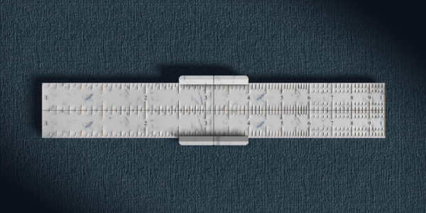

# Viu
Virtual design for models for vision impairement users.

Note! Do not look in this repository (so far there is only
garbage in it). By mid-September 2021 there should some
3D models ready.

# About

These models are build for the National Scientific Program
"Information and Communication Technologies in Science,
Education and Security" (ICTinSES) financed by the Ministry
of Education and Science.

Click on a snapshot to run it live in the browser.

# Pythagorean theorem

This is a virtual prototype of a 3D printed model that demonstrates
a visual proof of Pythagorean theorem. Its general layout is similar
to the 15 puzzle game. Instead of 15 squares there are 4 right
triangles that can slide inside a frame. The triangles can be moved
in a way to recreate the proof of the theorem.

The right trangle shape is configurable. Here are three versions of the same model:

Apart from demonstrating a visual and tactile proof of the Pythagorean theorem,
the application can be used to demonstrate or explore:

- Area of parallelograms;
- Garden of Eden puzzles;
- Similar right triangles;    
- Second degree equations.

# Slide rule

This is a virtual prototype of a 3D printed model of a slide rule.
It is modified version of an ordinary logarithmic slide rule, with
added relief marks and thread cursor. All three combonents &ndash;
the two rulers and the cursor can slide sideways.

The slide rule is configurable &ndash; it can be extended or shrinked,
which makes it possible to generate a slide rule for operations like
multiplication, division, square root, etc.

The application can be used to demonstrate or explore:

- Operations like <em>xy</em>, <em>x/y</em> and <em>1/x</em> ;
- Operations like <em>xn</em> and <em>n&Sqrt;x</em> ;
- Overflow and underflow calculations;
- Mathematical foundations of the slide rule.

# Papers

The models &ndash; design and applications are discussed in several papers and presented in several conferences:

- "Designing 3D-printer Models for Students with Vision Impairment or Low Vision" (pending review).
- "Virtual Prototypes of 3D Models for Students with Visual Impairment or Low Vision" (under construction).

<a href="https://github.com/boytchev/viu">View on GitHub</a>

